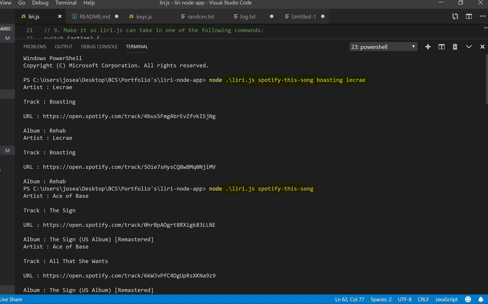

# liri-node-app

# Overview:
## This is a node.js application that uses multiple API's to show movies, songs and concerts.

* Screenshots (or a GIF/Video) of the user flow for this application. 

* Included Screenshots: Spotify, Bands in Town, and OMDB.
* 1. Function movieThis ()
    

* 2. Function spotifyThis ()
    

* 3. Function doThis()
    

* 4. Function concerThis()
    

* 5. Appending text to Log.txt only works for the spotifyThis() function.

<!--  -->
<!-- Format:  -->
